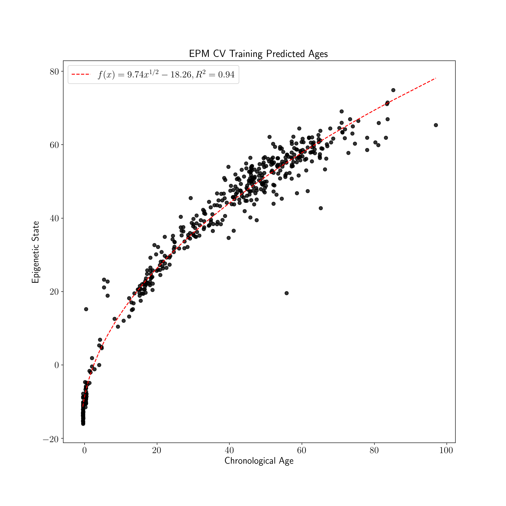
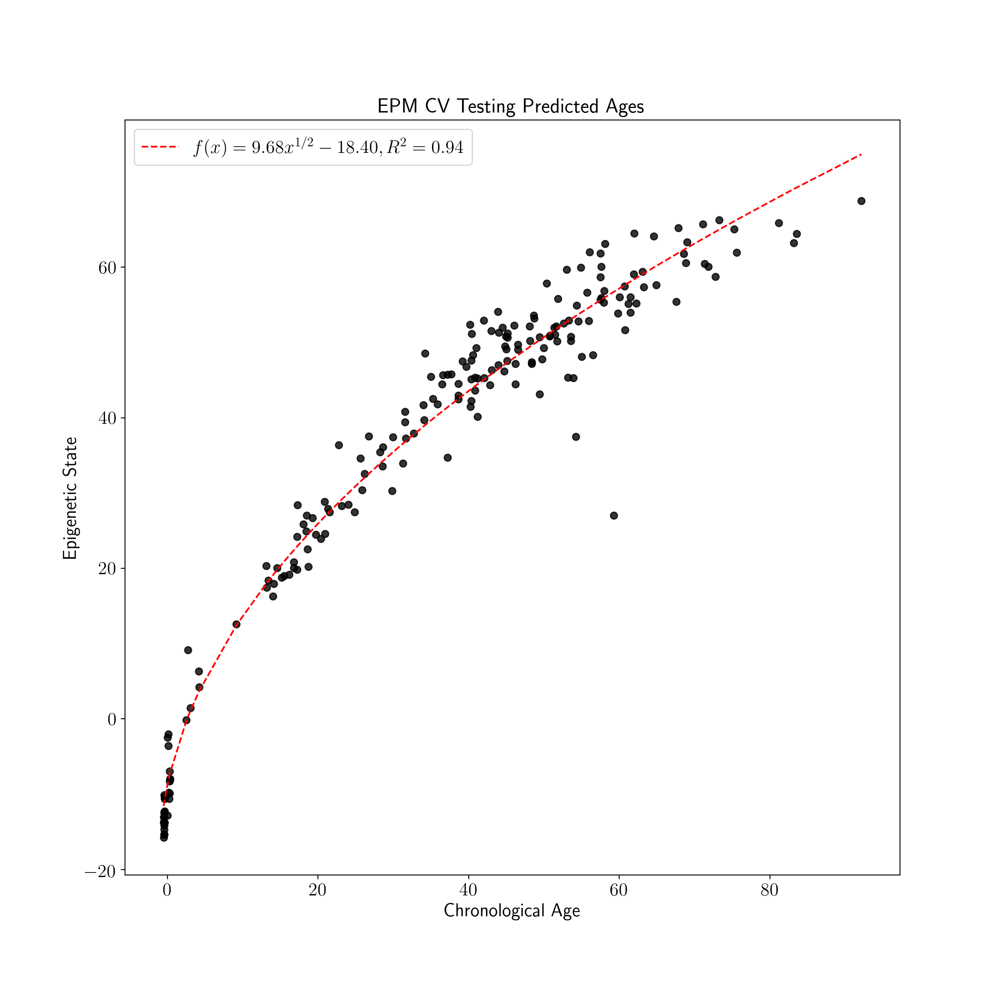
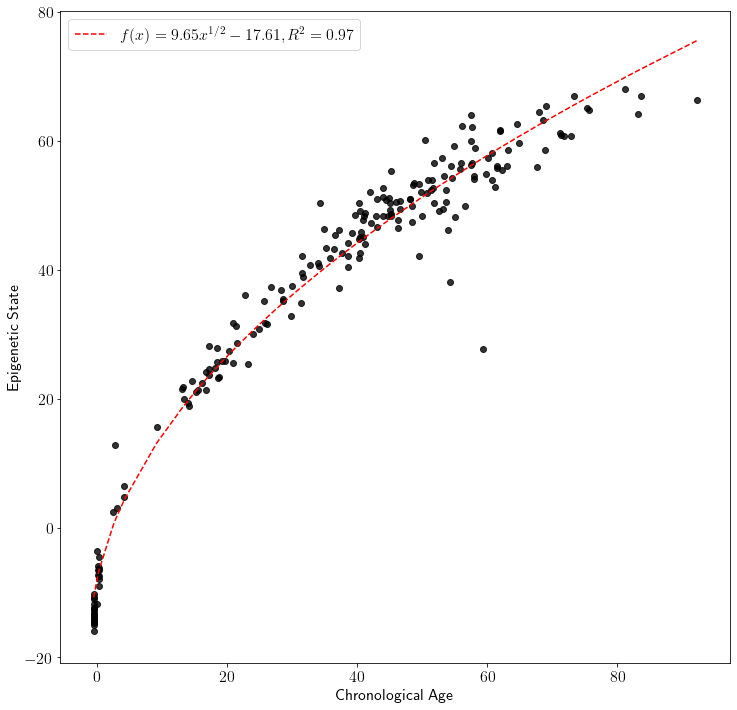

# Epigenetic Pacemaker Usage

## EPM Notes

1. The initial guess for the epigenetic state is generally the phenotype of interest
      1. An epigenetic aging model would use chronological ages
2. The EPM is modeling tool, site selection occurs outside of model fitting.
      1. This approach differs from penalized regression models commonly employed for epigenetic trait modeling, which
         perform site selection and model fitting simultaneously.  

## Example Data

Test data has been adapted from [GSE74193](https://www.ncbi.nlm.nih.gov/geo/query/acc.cgi?acc=GSE74193). The data were
generated by [Jaffe et al. 2015](https://doi.org/10.1038/nn.4181) as part of a study on DNA methylation patterns in the
frontal cortex during development. The data have been separated into training and testing sets by stratified sampling
of sample ages. Sampled data was then processed by selecting sites correlated with aging.

The data can be loaded by importing and calling the data importation function. The returned data contains a list of
GEO sample identifiers, CpG sites, sample age information, and an array of methylation beta values.  

```python
# import the data retrieval class
from EpigeneticPacemaker.ExampleData.DataSets import get_example_data
# retrieve the training and testing data
test_data, train_data = get_example_data()
# unpack the training and testing data
test_samples, test_cpg_sites, test_ages, test_methylation_values = test_data
train_samples, train_cpg_sites, train_ages, train_methylation_values = train_data
```

## Site Selection

Given a phenotype of interest and a methylation array the EPM is fit with trait associated CpG sites.
In this example Pearson correlation is used to select age associated sites by selecting sites with an absolute
correlation coefficient above a user specified threshold.

```python
import numpy as np

def pearson_correlation(meth_matrix: np.array, phenotype: np.array) -> np.array:
    """calculate pearson correlation coefficient between rows of input matrix and phenotype"""
    # calculate mean for each row and phenotype mean
    matrix_means = np.mean(meth_matrix, axis=1)
    phenotype_mean = np.mean(phenotype)

    # subtract means from observed values
    transformed_matrix = meth_matrix - matrix_means.reshape([-1,1])
    transformed_phenotype = phenotype - phenotype_mean

    # calculate covariance
    covariance = np.sum(transformed_matrix * transformed_phenotype, axis=1)
    variance_meth = np.sqrt(np.sum(transformed_matrix ** 2, axis=1))
    variance_phenotype = np.sqrt(np.sum(transformed_phenotype ** 2))

    return covariance / (variance_meth * variance_phenotype)

# get the absolute value of the correlation coefficient
abs_pcc_coefficients = abs(pearson_correlation(train_methylation_values, train_ages)) 

# return list of site indices with a high absolute correlation coefficient
training_sites = np.where(abs_pcc_coefficients > .85)[0]
```

## Helper Functions

To visualize the results of the EPM a helper function is used. The function takes chronological ages 
and predicted EPM states as an input; then generates a scatter plot and trend line for the model. 

```python
import numpy as np
import matplotlib.pyplot as plt
from matplotlib import rc
from scipy import optimize
import scipy.stats as stats

# use latex formatting for plots
rc('text', usetex=True)

def r2(x,y):
    # return r squared
    return stats.pearsonr(x,y)[0] **2

def plot_known_predicted_ages(known_ages, predicted_ages, label=None):
    # define optimization function
    def func(x, a, b, c):
        return a * np.asarray(x)**0.5 + c
    # fit trend line
    popt, pcov = optimize.curve_fit(func, [1 + x for x in known_ages], predicted_ages)
    # get r squared
    rsquared = r2(predicted_ages, func([1 + x for x in known_ages], *popt))
    # format plot label
    plot_label = f'$f(x)={popt[0]:.2f}x^{{1/2}} {popt[2]:.2f}, R^{{2}}={rsquared:.2f}$'
    # initialize plt plot
    fig, ax = plt.subplots(figsize=(12,12))
    # plot trend line
    ax.plot(sorted(known_ages), func(sorted([1 + x for x in known_ages]), *popt), 'r--', label=plot_label)
    # scatter plot
    ax.scatter(known_ages, predicted_ages, marker='o', alpha=0.8, color='k')
    ax.set_title(label, fontsize=18)
    ax.set_xlabel('Chronological Age', fontsize=16)
    ax.set_ylabel('Epigenetic State', fontsize=16)
    ax.tick_params(axis='both', which='major', labelsize=16)
    ax.legend(fontsize=16)
    plt.show()
```

## Fitting EPM

The EPM is fit by calling the fit method. Following model fitting predicted ages are generated for the test data using 
the predict method.

```python 
from EpigeneticPacemaker.EpigeneticPacemaker import EpigeneticPacemaker

# initialize the EPM model 
epm = EpigeneticPacemaker(iter_limit=100, error_tolerance=0.00001)

# fit the model using the training data
epm.fit(train_methylation_values[training_sites,:], train_ages)

# generate predicted ages using the test data
test_predict = epm.predict(test_methylation_values[training_sites,:])

# plot the model results 
plot_known_predicted_ages(test_ages, test_predict, 'EpigeneticPacemaker')
```


## Fitting Cross Validated EPM

The cross validated version of the EPM is fit using the same general process as the EPM following initialization with
additional parameters. During fitting of the cross validated EPM an epigenetic state prediction is made for each sample
when the sample is left out of model fitting. The reported EPM CV model is an average of model parameters across
CV folds.

```python
from EpigeneticPacemaker.EpigeneticPacemakerCV import EpigeneticPacemakerCV

# initialize the EPM model
epm_cv = EpigeneticPacemakerCV(iter_limit=100, error_tolerance=0.00001, cv_folds=10, verbose=False)

# fit the model using the training data
epm_cv.fit(train_methylation_values[training_sites,:], train_ages)

# generate predicted ages using the test data
test_cv_predicted_ages = epm_cv.predict(test_methylation_values[training_sites,:])

# get training sample EPM predictions during fold sample not used for training
train_cv_predicted_ages = epm_cv.predicted_states

# plot the training model results
plot_known_predicted_ages(train_ages, train_cv_predicted_ages, 'EPM CV Training Predicted Ages')

# plot the testing model results
plot_known_predicted_ages(test_ages, test_cv_predicted_ages, 'EPM CV Testing Predicted Ages')

```

Training EPM States              |  Testing EPM States
:-------------------------:|:-------------------------:
  |  

## Fitting Cross Validated Site Selection EPM  

When using to EPM to model epigenetic states in data sets with a limited number of samples it can be useful to fit
a cross validated model that includes site selection. In this example the EPM will be fit to different
methylation sites depending on the sites selected during each fold. This approach can be useful for modeling general
epigenetic state trends, but this method will not provide a universal predictive model.

Within each fold we perform stratified splitting by age. To do this we need to bin the observed
ages in the testing data.  

```python
# utilize bisect to bin
import bisect

def get_age_bins(ages, bin_number=20):
    binning = []
    interval = (max(ages) - min(ages)) / bin_number
    bin_ranges = [interval * x for x in range(bin_number)]
    for age in ages:
        binning.append(bisect.bisect_left(bin_ranges, age))
    return binning

# bin the ages 
age_bins = get_age_bins(test_ages, bin_number=6)

```

We then split the data into $k$ fold using scikit-learn [StratifiedKFold](https://scikit-learn.org/stable/modules/generated/sklearn.model_selection.StratifiedKFold.html).
Within each fold we perform site selection, model fitting, and we predict the epigenetic states of the out of fold samples.

```python
from sklearn.model_selection import StratifiedKFold

# select samples by index
sample_indices = np.array([x for x in range(len(age_bins))])

# perform 4 splits 
skf = StratifiedKFold(n_splits=4)

# initialize EPM, then refit within each fold 
epm = EpigeneticPacemaker()

# dictionary to hold out of fold predicitons 
cv_ages = {}

for train, test in skf.split(sample_indices, age_bins):
    # get the absolute value of the correlation coefficient
    train_fold_meth = test_methylation_values[:, train]
    train_fold_ages = test_ages[train]

    # select sites
    abs_pcc_coefficients = abs(pearson_correlation(train_fold_meth, train_fold_ages))
    training_sites = np.where(abs_pcc_coefficients > .85)[0]

    # fit EPM
    epm.fit(train_fold_meth[training_sites,:], train_fold_ages)

    # predict and save out of fold epigenetic state predictions
    test_fold_methylation = test_methylation_values[:, test]
    predicted_ages = epm.predict(test_fold_methylation[training_sites,:])
    cv_ages.update({index:age for index, age in zip(test, predicted_ages)})

# plot results
known_ages = [test_ages[index] for index in cv_ages.keys()]
plot_known_predicted_ages(known_ages, list(cv_ages.values()))
```

