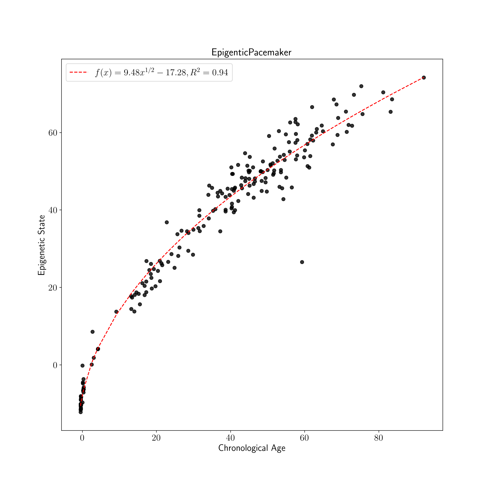
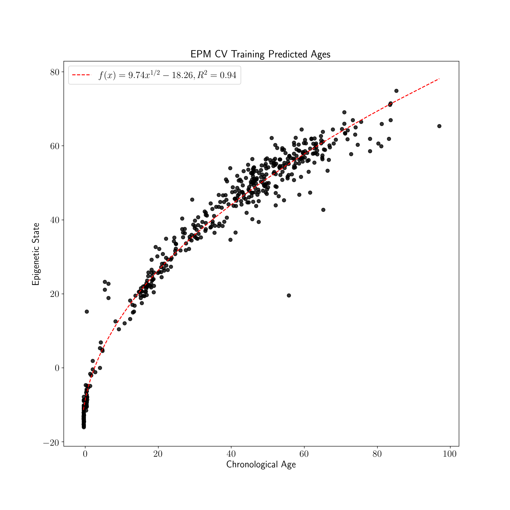
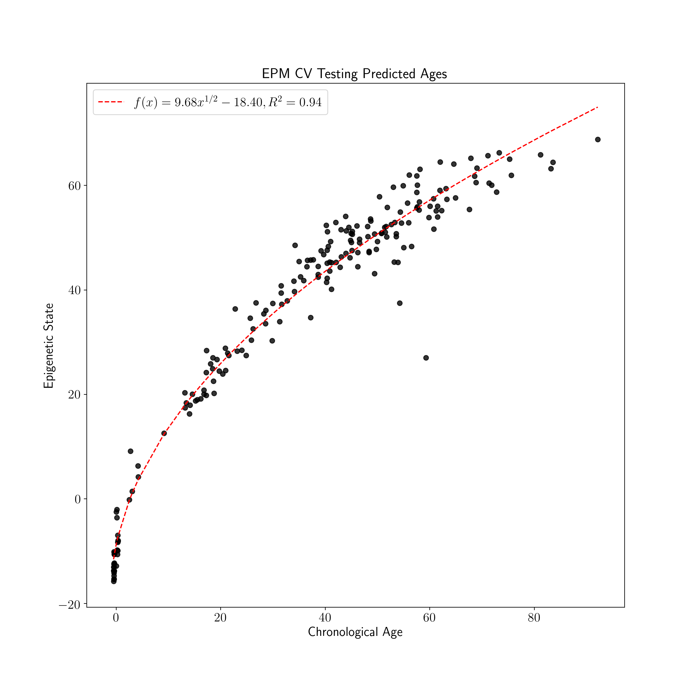

# Epigenetic Pacemaker Usage 

The Epigenetic Pacemaker, **EPM**, fits a linear model for each input methylation site and then minimize the observed error 
across sites by updating the epigenetic states of the input samples. While the fit epigenetic state the has a linear relationship with the input methylation sites
 the trait of interest may not. In this way the EPM can directly modeling non-linear trait, epigenetic relationships. 
 The initial guess for the epigenetic state is generally the phenotype of interest; ie. an EPM model is trained with 
 age associated sites and chronological ages to model epigenetic aging. The EPM is fit using sites of interest, and no site selection is 
performed during model fitting in contrast with penalized regression models commonly employed for epigenetic trait modeling.  


## Example Data
Test data has been adapted from [GSE74193](https://www.ncbi.nlm.nih.gov/geo/query/acc.cgi?acc=GSE74193) which contains Illumina 450k array data and chronological ages 
for 676 samples. The data were generated by [Jaffe et al. 2015](https://doi.org/10.1038/nn.4181) as part of a study on DNA methylation patterns in the frontal cortex 
in during development. The data have been separated into training and testing sets using stratified sampling across ages. Following splitting, sites correlated with aging were selected using 
Pearson correlation to reduce the size of the resulting methylation array. 
 
The data can be loaded by importing and calling the data importation function. The returned data contains a list of GEO sample identifiers, CpG sites, sample age information, 
and an array of methylation beta values.  

```python
# import the data retrieval class
from EpigeneticPacemaker.ExampleData.DataSets import get_example_data
# retrieve the training and testing data
test_data, train_data = get_example_data()
# unpack the training and testing data
test_samples, test_cpg_sits, test_ages, test_methylation_values = test_data
train_samples, train_cpg_sits, train_ages, train_methylation_values = train_data
```

## Site Selection 

Given a phenotype of interest and a methylation array the EPM is fit with trait associated CpG sites. In this example Pearson correlation is used to 
select age associated sites by selecting sites with an absolute correlation coefficient above a user specified threshold. 

```python
import scipy.stats as stats


def select_correlated_sites(methylation_array, phenotype, threshold=.85):
    # save index of sites highly correlated with age 
    correlated_sites = []
    for index, site in enumerate(methylation_array):
        if abs(stats.pearsonr(site, phenotype)[0]) >= threshold:
            correlated_sites.append(index)
    return correlated_sites

# run the selection function to get a list of correlated site indices 
training_sites = select_correlated_sites(train_methylation_values, train_ages)
```

## Helper Functions

To visualize the results of the EPM a helper function is used. The function takes chronological ages 
and predicted EPM states as an input; then generates a scatter plot and trend line for the model. 

```python
import numpy as np
import matplotlib.pyplot as plt
from matplotlib import rc
from scipy import optimize

# use latex formatting for plots
rc('text', usetex=True)

def r2(x,y):
    # return r squared
    return stats.pearsonr(x,y)[0] **2

def plot_known_predicted_ages(known_ages, predicted_ages, label=None):
    # define optimization function
    def func(x, a, b, c):
        return a * np.asarray(x)**0.5 + c
    # fit trend line
    popt, pcov = optimize.curve_fit(func, [1 + x for x in known_ages], predicted_ages)
    # get r squared
    rsquared = r2([1 + x for x in known_ages], func([1 + x for x in known_ages], *popt))
    # format plot label
    plot_label = f'$f(x)={popt[0]:.2f}x^{{1/2}} {popt[2]:.2f}, R^{{2}}={rsquared:.2f}$'
    # initialize plt plot
    fig, ax = plt.subplots(figsize=(12,12))
    # plot trend line
    ax.plot(sorted(known_ages), func(sorted([1 + x for x in known_ages]), *popt), 'r--', label=plot_label)
    # scatter plot
    ax.scatter(known_ages, predicted_ages, marker='o', alpha=0.8, color='k')
    ax.set_title(label, fontsize=18)
    ax.set_xlabel('Chronological Age', fontsize=16)
    ax.set_ylabel('Epigenetic State', fontsize=16)
    ax.tick_params(axis='both', which='major', labelsize=16)
    ax.legend(fontsize=16)
    plt.show()
```

## Fitting EPM

The EPM is fit by calling the fit method. Following model fitting predicted ages are generated for the test data using 
the predict method.

```python 
from EpigeneticPacemaker.EpigeneticPacemaker import EpigeneticPacemaker

# initialize the EPM model 
epm = EpigeneticPacemaker(iter_limit=100, error_tolerance=0.00001)

# fit the model using the training data
epm.fit(train_methylation_values[training_sites,:], train_ages)

# generate predicted ages using the test data
test_predict = epm.predict(test_methylation_values[training_sites,:])

# plot the model results 
plot_known_predicted_ages(test_ages, test_predict, 'EpigenticPacemaker')
```

## Fitting Cross Validated EPM

The cross validated version of the EPM is fit using the same general process as the EPM following initialization with 
slightly more parameters. During fitting of the cross validated EPM an epigenetic state prediction is made for each sample 
when the sample is left out of model fitting. The reported EPM CV model is an average of model parameters across CV folds. 

```python
from EpigeneticPacemaker.EpigeneticPacemakerCV import EpigeneticPacemakerCV

# initialize the EPM model 
epm_cv = EpigeneticPacemakerCV(iter_limit=100, error_tolerance=0.00001, , cv_folds=10, verbose=False)

# fit the model using the training data
epm_cv.fit(train_methylation_values[training_sites,:], train_ages)

# generate predicted ages using the test data
test_cv_predicted_ages = epm_cv.predict(test_methylation_values[training_sites,:])

# get training sample EPM predictions during fold sample not used for training
train_cv_predicted_ages = epm_cv.predicted_states

# plot the training model results
plot_known_predicted_ages(train_ages, train_cv_predicted_ages, 'EPM CV Training Predicted Ages')

# plot the testing model results
plot_known_predicted_ages(test_ages, test_cv_predicted_ages, 'EPM CV Testing Predicted Ages')

```
Training EPM States              |  Testing EPM States
:-------------------------:|:-------------------------:
  |  


